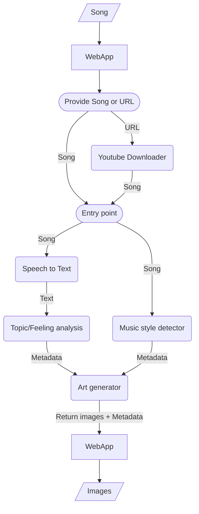

```mermaid
flowchart
    Input[/Song/] --> A
    A[WebApp] --> B([Provide Song or URL])
    B --> |Song| Y([Entry point])
    B --> |URL| C(Youtube Downloader)
    C --> |Song| Y
    Y --> |Song| G(Music style detector)
    Y --> |Song| F(Speech to Text)
    F --> |Text| H(Topic/Feeling analysis)
    H --> |Metadata| I(Art generator)
    G --> |Metadata| I
    I --> |Return images + Metadata| J[WebApp]
    J --> Output[/Images/]
```