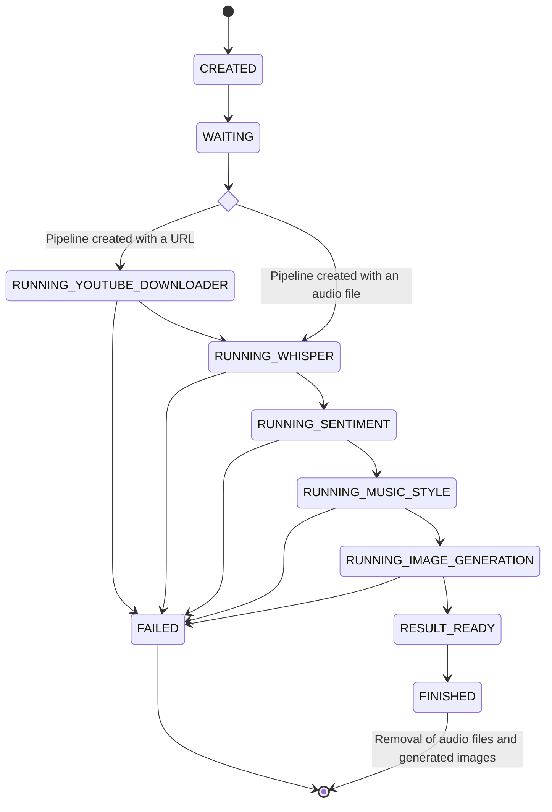

```mermaid
stateDiagram
    state if_state <<choice>>
    [*] --> CREATED
    CREATED --> WAITING
    WAITING --> if_state
        RUNNING_YOUTUBE_DOWNLOADER --> RUNNING_WHISPER
    if_state --> RUNNING_YOUTUBE_DOWNLOADER: Pipeline created with a URL
    if_state --> RUNNING_WHISPER : Pipeline created with an audio file
    RUNNING_WHISPER --> RUNNING_SENTIMENT
    RUNNING_SENTIMENT --> RUNNING_MUSIC_STYLE
    RUNNING_MUSIC_STYLE --> RUNNING_IMAGE_GENERATION
    RUNNING_IMAGE_GENERATION --> RESULT_READY
    RESULT_READY --> FINISHED
    RUNNING_YOUTUBE_DOWNLOADER --> FAILED
    RUNNING_WHISPER --> FAILED
    RUNNING_SENTIMENT --> FAILED
    RUNNING_MUSIC_STYLE --> FAILED
    RUNNING_IMAGE_GENERATION --> FAILED
    FAILED --> [*]
    FINISHED --> [*]: Removal of audio files and generated images
```