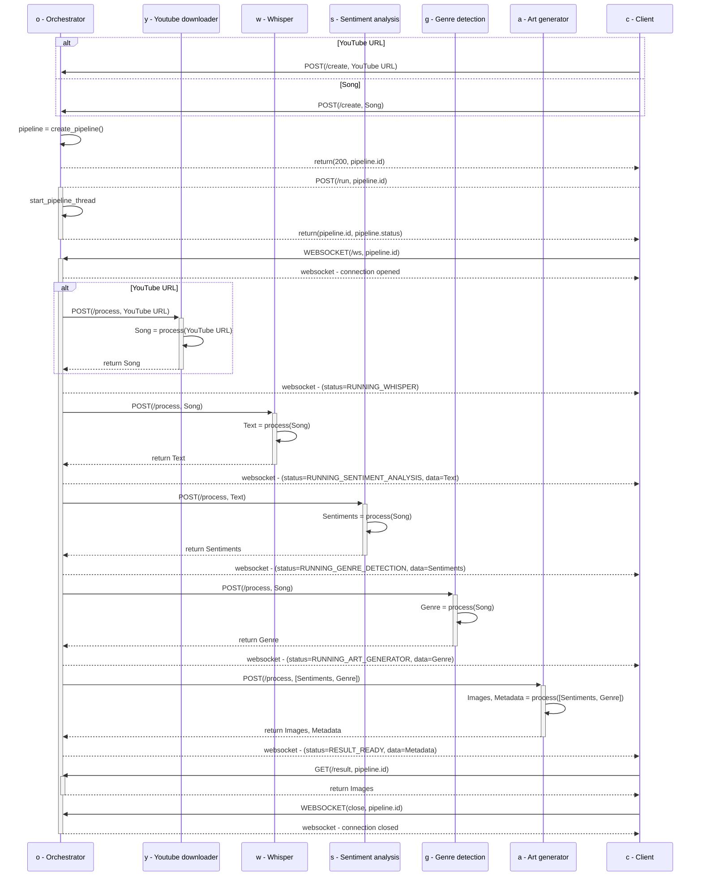

```mermaid
sequenceDiagram
    participant O as o - Orchestrator
    participant Y as y - Youtube downloader
    participant W as w - Whisper
    participant S as s - Sentiment analysis
    participant G as g - Genre detection
    participant A as a - Art generator
    participant C as c - Client
    alt YouTube URL
        C->>O: POST(/create, YouTube URL)
    else Song
        C->>O: POST(/create, Song)
    end
    O->>O: pipeline = create_pipeline()
    O-->>C: return(200, pipeline.id)
    C-->+O: POST(/run, pipeline.id)
    O->>O: start_pipeline_thread
    O-->>-C: return(pipeline.id, pipeline.status)
    C->>+O: WEBSOCKET(/ws, pipeline.id)
    O-->>C: websocket - connection opened
    alt YouTube URL
        O->>+Y: POST(/process, YouTube URL)
        Y->>Y: Song = process(YouTube URL)
        Y-->>-O: return Song
    end
    O-->>C: websocket - (status=RUNNING_WHISPER)
    O->>+W: POST(/process, Song)
    W->>W: Text = process(Song)
    W-->>-O: return Text
    O-->>C: websocket - (status=RUNNING_SENTIMENT_ANALYSIS, data=Text)
    O->>+S: POST(/process, Text)
    S->>S: Sentiments = process(Song)
    S-->>-O: return Sentiments
    O-->>C: websocket - (status=RUNNING_GENRE_DETECTION, data=Sentiments)
    O->>+G: POST(/process, Song)
    G->>G: Genre = process(Song)
    G-->>-O: return Genre
    O-->>C: websocket - (status=RUNNING_ART_GENERATOR, data=Genre)
    O->>+A: POST(/process, [Sentiments, Genre])
    A->>A: Images, Metadata = process([Sentiments, Genre])
    A-->>-O: return Images, Metadata
    O-->>C: websocket - (status=RESULT_READY, data=Metadata)
    C->>+O: GET(/result, pipeline.id)
    O-->>-C: return Images
    C->>O: WEBSOCKET(close, pipeline.id)
    O-->>-C: websocket - connection closed
```